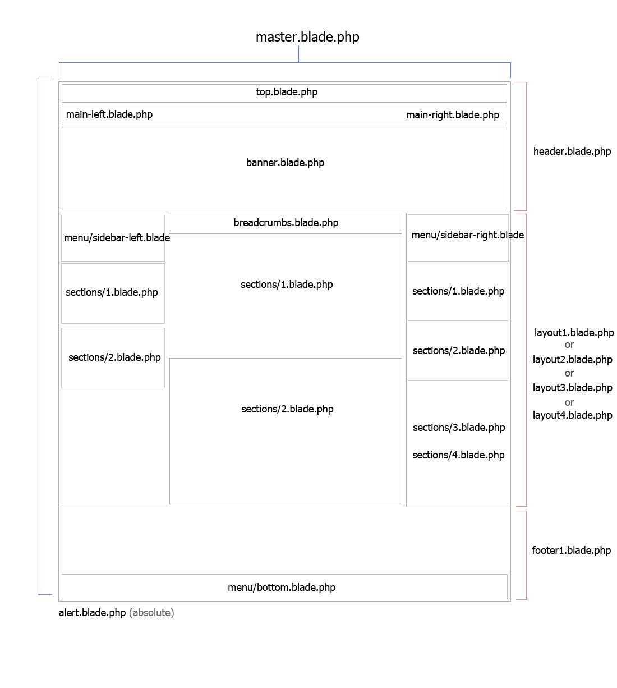

### Template Specification Base

โครงสร้างสำหรับ Developer

## Structure

```text
        │ ├── resource/images/thumb-s.png
        │ ├── resource/images/thumb-m.png
        │ ├── resource/view/user/layouts/master.blade.php
        │ ├── resource/view/user/layouts/master-blank.blade.php
        │ ├── resource/view/user/layouts/layout1.blade.php
        │ ├── resource/view/user/layouts/layout2.blade.php
        │ ├── resource/view/user/layouts/layout3.blade.php
        │ ├── resource/view/user/layouts/layout4.blade.php
        │ ├── resource/view/user/layouts/index.blade.php
        │ ├── resource/view/user/partials/breadcrumbs.blade.php
        │ ├── resource/view/user/partials/userprofile???.blade.php
        │ ├── resource/view/user/header??
        │ ├── resource/view/user/alert.blade.php
        │ ├── resource/view/user/menu/top.blade.php
        │ ├── resource/view/user/menu/main-left.blade.php
        │ ├── resource/view/user/menu/main-right.blade.php
        │ ├── resource/view/user/menu/sidebar-left.blade.php
        │ ├── resource/view/user/menu/sidebar-right.blade.php
        │ ├── resource/view/user/menu/bottom.blade.php
        │ ├── resource/view/user/protected/sections/1.blade.php
        │ ├── resource/view/user/protected/sections/2.blade.php
        │ ├── resource/view/user/footer??
        │ ├── resource/view/user/partials/customhead.blade.php
```



การตั้งชื่อ 
- css : ชื่อคลาสที่ใช้ในส่วนดีไซต์จะใช้ขีดกลาง(Kebab)  เช่น rv-name
- js :  ชื่อคลาสที่ระบุใน html เพื่อให้ js เรียกใช้งาน เช่น class="js-name" หรือใช้แบบ attribute `<a data-editor="value"> test</a>` 
- ชื่อคลาส แบ่งส่วนประกอบเท็มเพลต : ยกตัวอย่าง เช่น id="selected-header", id="selected-footer"
- การเขียน Template blade variables ยกตัวอย่าง เช่น {!! $templateSiteTitle !!} 
- editable_area คือ css ที่ใช้เฉพาะ edit mode กำหนดพื้นที่จุดที่สามารถเปลี่ยนแปลงได้ (เปลี่ยนเป็น editable-area)
- ชื่อคลาสที่ js เรียกใช้งานหเฉพาะฝั่ง edit mode เช่น app-name, editable_area, layoutfix โดยจะไม่ถูก publish โดยเปลี่ยนเป็นขีดกลาง(Kebab) เช่น class="js-xxxx-xxx"
- ชื่อคลาสที่ระบุใน html ที่ใช้เฉพาะส่วน edit mode โดย css จะอยู่ในไฟล์ editor.css ไม่ถูก publish โดยเปลี่ยนเป็นขีดกลาง(Kebab) เช่น class="xxxx-xxxx-xxx"
- ชื่อคลาสที่ระบุใน html ที่สัมพันธ์กับเครื่องมือของโปรแกรมนอกเฟรมเท็มเพลต ที่ใช้เฉพาะส่วน edit mode โดย css จะอยู่ในไฟล์ editor.css ไม่ถูก publish โดยเปลี่ยนเป็นขีดกลาง(Kebab) เช่น class="app-xxxx-xxx"
  

## Config

template.json ภายในมีอะไรบ้าง (ถ้าโปรแกรมเมอร์ปรับ เพิ่ม ให้มาปรับตรงนี้ด้วย)

```text
  id : template_1
  category_id : 1
  description : Template เกี่ยวกับอะไร
  version : 1.0
  header : 1
  footer : 1
  menu : 1-main
  topmenu : 1
  use_sidebar : 1
  theme : 1
  use_form : true
  banner : 1
      pages : {
      "Home": {
                          "sections" :["1"], ["2"]
      },
      "About": {
                          "sections" :["1"], ["2"]
      }
    }

  theme : 1
  css-framework : uikit3

 ```

 ## Image Thumbnail Preview
 - Name : ตั้งชื่อรูปตัวอย่างแท็มเพลต large-preview.png (ซึ่งใช้แสดงตัวอย่างใน step Template)
 - Type of file : .png
 - Image Size : ไม่เกิน 200kb
 - Dimensions : 400 x auto 

 ## Maximum Folder Template
  
- Export / Import โฟล์เดอร์เท็มเพลตรวมกันเป็นไฟล์สกุลใดๆ ไม่เกิน 2 MB ที่ประกอบด้วย Blade File, Thumbnail, Image, template.json, อื่นๆ
- Export / Import โฟล์เดอร์เท็มเพลตเป็นไฟล์สกุล .tar, .tar.gz, .zip
  
## Master Template

โครงสร้าง Master ประกอยด้วยตัวแปรและเลเอาท์ครอบนอกสุดมี ID และ Class ที่ใช้ในฝั่ง edit mode และ view mode 
ใช้โค้ดเริ่มต้นเป็น uikit3 

Master.blade.php

```html
<!DOCTYPE html>
<html lang="{{ app()->getLocale() }}">
  <head>
     {!! $head !!}
      
     @include('user.layouts.partials.head')
     @include('user.layouts.partials.customhead')

  </head>

  <body id="app-layout">
    <div class="app-viewmode">
      <div id="app">

        <!-- เริ่ม Template Website สำหรับไฟล์ Template App Overwrite ตั้งชื่อ index.blade.php -->  
        <div data-editor="editor" data-css="uikit3">
          <div class="rv-wrapper {{ $fullwidth }}">

            <header id="selected-header">
              {!! $header !!}
            </header>

            <main id="selected-body">
              {!! $layout !!}
            </main>

            <footer id="selected-footer">
              <div class="editable_area">
                {!! $footer !!}
              </div>
            </footer>
  
            <div id="selected-navigator-mobile">
                {!! $mobileMenu !!}
            </div>
        

          </div> 
        </div> 

      </div>
    </div><!-- End view-mode -->

    {!! $javaScript !!}  
    {!! $alert !!}

  </body>
</html>
```
@TODO: 
- app-viewmode: ชื่อเดิม bodyTemplate ย้ายไว้ด้านบน <div class="bodyTemplate"> เนื่องจากใช้ใน editmode อย่างเดียว มีผลให้ fullwidth พัง js เรียกลำดับคลาส selector ย้อนขึ้น ต้องแก้ใหม่โดยใช้ data-editor และ js เรียกใช้งานหลายที่กับเลเอาท์ฝั่ง edit mode สำหรับ css ใช้กับเมนูกลุ่ม Responsive Mode 
- {!! $head !!} : ให้ใส่เป็น Variable สำหรับโปรแกรมโค้ดที่อื่น เพื่อรองรับการ Overwrite
- {!! $javaScript !!} แทนค่าตำแหน่งที่วาง js css เพื่อรองรับการ Overwrite
- {!! $Layout !!} : เรียกไฟล์ layout1.blade.php, layout2.blade.php, layout3.blade.php, layout4.blade.php
- {!! $alert !!} : เรียกไฟล์ Notify มาแสดง เป็น absolute อยู่ส่วนใดก็ได้บนแท็มเพลต เรียกไฟล์ user/alert.blade.php
- app-layout : jsเรียกใช้งาน (/js/plugins/SiteTheme/init.js) 
- rv-wrapper : เดิม คือดีไซต์ uk-container uk-container-center
- app : คือ id="app" jsเรียกใช้งาน (assets/js/app.js) 
- {{ $fullwidth }} ใช้ในการตั้งค่า fullwidth ทั้งเว็บไซต์ ที่เมนู Design >> Website
- data-editor="editor" : ใช้งานกับ Editor WYS
- data-css="uikit3" :  ใช้งานกับ css framework อะไร
- #selected_body คือ มีเฉพาะ master มีผลตอนลากวาง(drag and drop) section 
- rvcmsfooter คือ ใช้ใน plugin footer
  
- @include('user.layouts.partials.customhead') สร้างไฟล์ blade ใหม่เมื่อต้องการเรียก `<link />, <script>..</script>` ต่างๆ Overwrite ในแท็ก head ได้ 
- index.blade.php เอาไปสร้างเป็นไฟล์ blade ซึ่งภายในมีแท็ก header, main, footer โดยไม่ให้ overwrite ไฟล์ master แต่ให้ overwrite ไฟล์ index แทน

## Head Tag

แท็กต่างๆ ที่อยู่ภายใน `<head>…..</head>`
Site Config , SEO, Favicon, css/js Component, css/js ของ RVsitebuilder, Theme/Custom 

โดยสร้างไฟล์หลัก 2 ไฟล์ เพื่อแยกการเรียกใช้ไฟล์ย่อยๆ ดังนี้
- @include('user.layouts.partials.head')  ใช้เรียกไฟล์หลักเฉพาะโปรแกรมของเราเท่านั้นโดยไม่ให้ Overwrite จะแยกย่อยไฟล์สำหรับโปรแกรมในแต่ละส่วน เช่น

```
  @include('user.layouts.partials.head.meta')
  @include('user.layouts.partials.head.seo')
  @include('user.layouts.partials.head.hreflang')
  @include('user.layouts.partials.head.favicons')
  <link rel="stylesheet" href="{{ mix('css/xxx.css') }}">
  <script defer src="{{ mix('js/user.xxx.js') }}"></script>
      
```

- @include('user.layouts.partials.customhead')

 สร้างไฟล์ใหม่เพื่อให้ Designer สามารถเรียกลิ้งไฟล์ต่างๆเกี่ยวกับธีมแท็มเพลต (Overwrite ได้) 


@TODO: แยกย่อยไฟล์สำหรับโปรแกรมในแต่ละส่วน เพื่อรองรับการ Overwrite

## Index
 
  ใน master.blade.php จะมีส่วนที่เรียกไฟล์ @include('user.layouts.index') เพื่อสามารถ Overwrite ให้มีความแตกต่างกันได้ เช่น
  - สามารถใส่ดีไซต์ได้
  - สลับตำแหน่งได้ 
  - เพิ่มเติมแท็ก HTML ใหม่ๆ เช่น สร้าง section เพื่อวาง Feed , Visitor... 
  - สามารถวางปุ่ม Offcanvas เพื่อเปิดส่วน Slide in / Slide out ในตำแหน่งใหม่ๆ เช่น ซ้าย,ขวา,บน,ล่าง ได้

 index.blade.php

```
  <div data-editor="editor" data-css="uikit3">
    <div class="rv-wrapper {{ $fullwidth }}">

      <header id="selected-header">
        {!! $header !!}
      </header>

      <main id="selected-body">
        {!! $layout !!}
      </main>

      <footer id="selected-footer">
        <div class="editable_area">
          {!! $footer !!}
        </div>
      </footer>

      <div id="selected-navigator-mobile">
          {!! $mobileMenu !!}
      </div>


    </div> 
  </div> 
```
## Body Tag

เริ่มแท็ก `<body>…..</body>`
ภายในแสดง โครงสร้าง Template ประกอบด้วย `<header>..</header>, <main>..</main>, <footer>..</footer>` มี id #selected-header, #selected-body, #selected-footer, #selected-navigator-mobile อยู่ในแต่ละแท็ก

